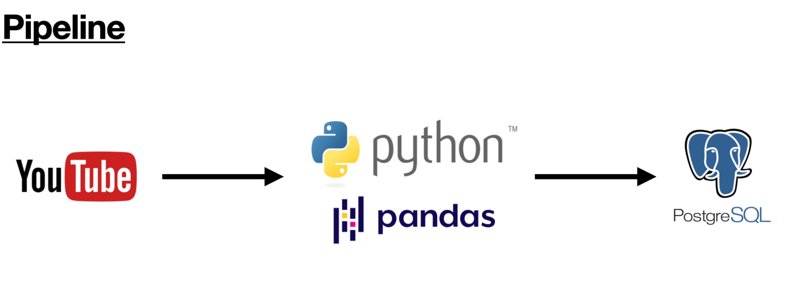

# About
A simple ETL data pipeline that extract data from a random channel from Youtube with Youtube Data v3 API and transform and load them into Postgres Database with Python.

# Pipeline

# Requirements

1) Live Postgres Database hosted on a server
2) Jupyter Notebook Environment
3) Google cloud API key for Youtube data v3

**Languages**
* Python 3.7
* Pandas
* PostgreSQL

**External Packages**
* psycopg2
* googleapiclient

# Development process
1) Set up a Postgres database instance on ElephantSQL.
2) Set up google cloud api services to get api key for youtube data.
3) Use googleapiclient package to extract a random youtube channel's public videos data.
4) Convert these videos data into Pandas dataframe and transform them to get ready to load into Postgres.
5) Use psycopg2 package and load the dataframe into Postgres database.

