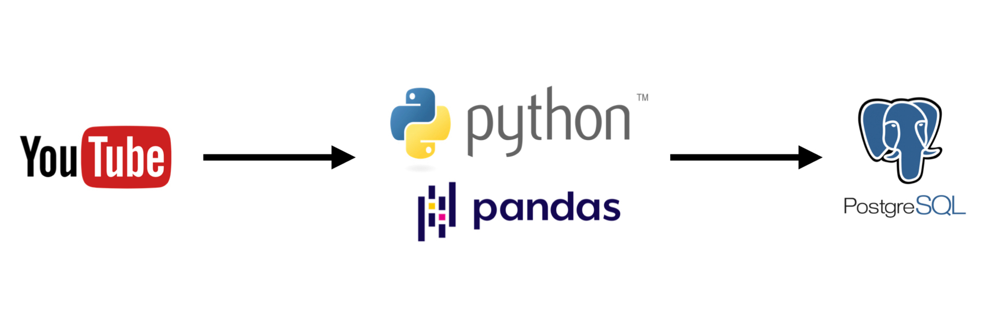

# About
A simple ETL data pipeline that extract data from a random channel from Youtube with Youtube Data v3 API and transform and load them into Postgres Database with Python.

# Pipeline

# Requirements

1) Live Postgres Database hosted on a server
2) Jupyter Notebook Environment
3) Google API key for Youtube data v3

**Languages**
* Python 3.7
* Pandas
* PostgreSQL

**External Packages**
* psycopg2

